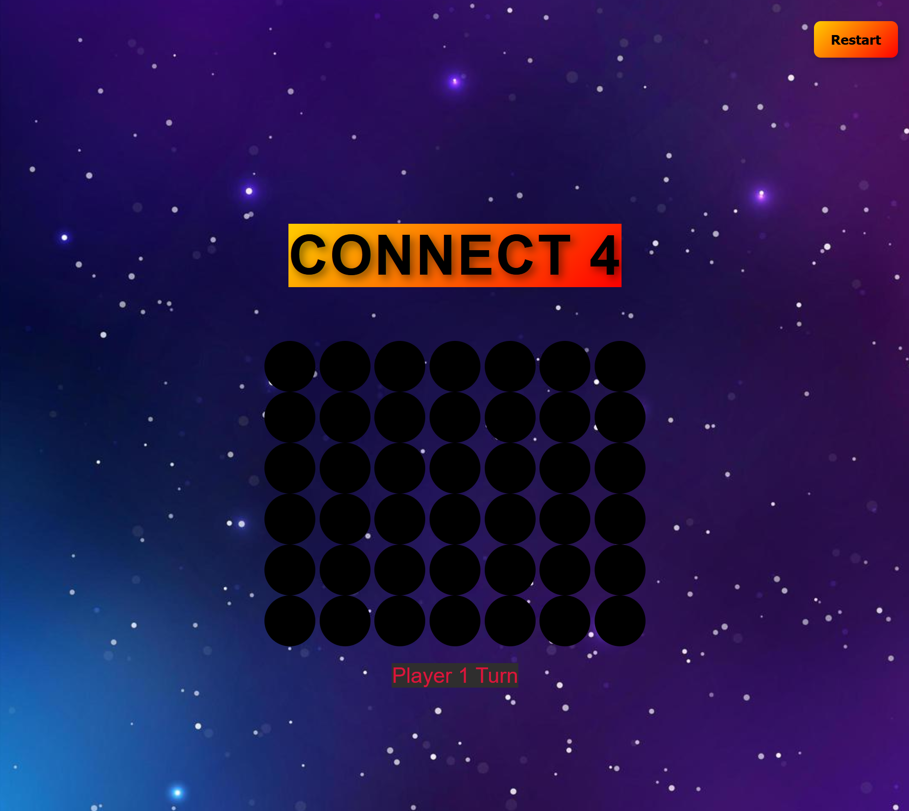

# Connect 4
<a href="https://robrob7.github.io/mp_game_js/html/index.html" target="_blank" rel="noopener noreferrer">Play Now</a>

Connect 4 is a classic two-player strategy game recreated in JavaScript, featuring smooth, interactive gameplay directly in the browser. Players take turns dropping colored discs into a vertical grid, aiming to connect four in a row, either horizontally, vertically, or diagonally, before their opponent does.

